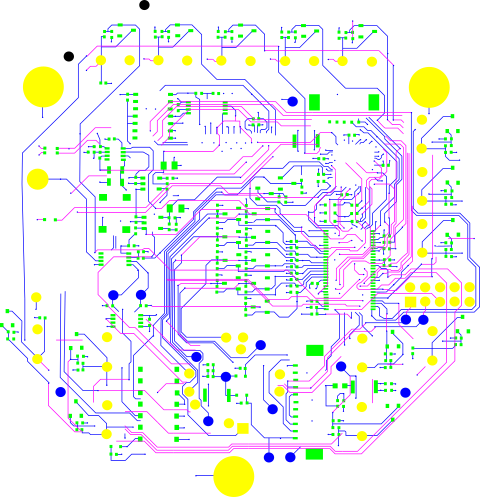

# RED ONE MYSTERIUM-X
*Disclaimer: This repository is for educational purposes only.*

These cameras (and the components within) are no longer repairable
by the manufacturer, and very little information exists on the Internet
(or from the manufacturer) that can assist with the debugging, and repair of
RED ONE MX cameras.

Fortunately, the technology within these digital cinema cameras still have value.

## Overview
The RED ONE MX is a digital cinema camera that uses a 14 Megapixel MYSTERIUM-X
sensor [1]. The sensor data is processed through an FPGA (Xilinx Virtex-4) and
then persisted to a drive (SSD, CF, or Hard Drive). It was effectively the
industry-first digital cinema camera that was equivalent to 35mm movie film.

### CPU_IO Board

#### Top

#### Bottom

### AUDIO_PCI Board
* ISP1562
 * Universal serial bus PCI host controller
* NET2280REV1A-LF
 * USB Bridge, USB to SPI USB 2.0 Interface
* SiI3512ECTU128
 * SATA 2-port PCI host controller
* PCA9698DGG
 * 40-bit parallel I/O port expansion for I2C-bus
* TMDS141
 * HDMI Hider
* DAC23
 * Stereo audio D/A converter, 8 to 96kHz with integrated headphone amplifier
* PGA2500I
 * Digitally controller microphone preamplifier
* GS2978
 * 3G SDI cable driver

#### Top

#### Bottom

### UI Board
Provides the physical control interface for camera operators.

* LTBPY
 * Hot swappable 2-wire bus buffer
* PCA9698DGG
 * 40-bit parallel input/output (I/O) port expansion for I2C-bus
* AD5241
 * 256-Position Digital Potentiometers
* R3032XL
 * CoolRunner XPLA3 CPLD

#### Top

#### Top

#### Layout

## Common issues (wip)
These are common issues that have been seen with the RED ONE MX cameras.

1. Unable to detect SSD, RED Drive, or CF Modules.
* Fault with the CPU_IO and AUDIO_PCI board interconnect.

2. No SDI or HDMI output.
* Fault with the CPU_IO and AUDIO_PCI board interconnect.

3. No audio input through XLR.
* Fault with the CPU_IO and AUDIO_PCI board interconnect.

### Fault with the CPU_IO and AUDIO_PCI board interconnect.
If the video (sdi, hdmi), xlr audio, and storage (cf, ssd, hard drive) are not
working, it is possible that the interconnect (part number ?) between the CPU_IO
and AUDIO_PCI board has broken traces on the CPU_IO board.

### Resources
1. https://support.red.com/hc/en-us/articles/360011307074-RED-ONE-Specs

### About the author
I'm the proud owner of several RED ONE MX digital cinema cameras.
Some of them work, and some don't. I have tremendous respect and admiration of
RED Digital Cinema, their products, and their innovation in the film industry.

#### License
Permission is hereby granted, free of charge, to any person obtaining a copy
of this software and associated documentation files (the "Software"), to deal
in the Software without restriction, including without limitation the rights
to use, copy, modify, merge, publish, distribute, sublicense, and/or sell
copies of the Software, and to permit persons to whom the Software is
furnished to do so, subject to the following conditions:

The above copyright notice and this permission notice shall be included in all
copies or substantial portions of the Software.

THE SOFTWARE IS PROVIDED "AS IS", WITHOUT WARRANTY OF ANY KIND, EXPRESS OR
IMPLIED, INCLUDING BUT NOT LIMITED TO THE WARRANTIES OF MERCHANTABILITY,
FITNESS FOR A PARTICULAR PURPOSE AND NONINFRINGEMENT. IN NO EVENT SHALL THE
AUTHORS OR COPYRIGHT HOLDERS BE LIABLE FOR ANY CLAIM, DAMAGES OR OTHER
LIABILITY, WHETHER IN AN ACTION OF CONTRACT, TORT OR OTHERWISE, ARISING FROM,
OUT OF OR IN CONNECTION WITH THE SOFTWARE OR THE USE OR OTHER DEALINGS IN THE
SOFTWARE.

RED, ONE, and MYSTERIUM-X are trademarks of RED.COM, LLC, registered in the U.S.
and other countries.
